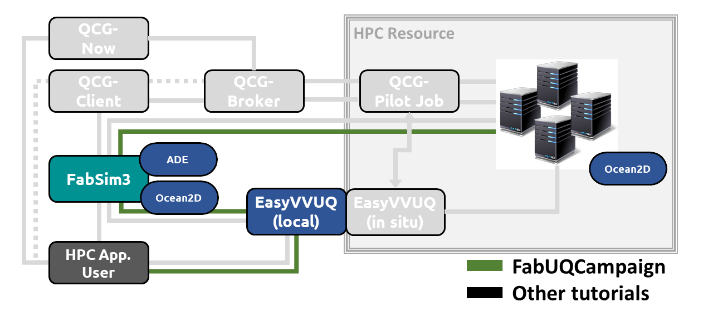

# FabUQCampaign
This tutorial runs Advection Diffusion Equation (ADE) samples from a (local)  campaign using  via the `campaign2ensemble` subroutine. Jobs can be executed locally or be sent to an HPC resource:



## Installation
To install all dependencies, first follow the instructions in https://github.com/wedeling/FabUQCampaign/blob/master/Tutorial_Setup.md

## Explanation of files

+ The `FabUQCampaign` directory contains all files listed below. This directory is located at `<fab_home>/plugins/FabUQCampaign`, where `<fab_home>` is your FabSim3 home directory.

+ `FabUQCampaign/FabUQCampaign.py`: contains the `run_UQ_sample` subroutine in which the job properties are specified, e.g. number of cores, memory, wall-time limit etc.

+ `FabUQCampaign/examples/advection_diffusion/*`: an example script, applying EasyVVUQ to a 1D advection diffusion equation. See the Detailed Example section below.

+ `FabUQCampaign/templates/ade`: contains the command-line instruction to draw a single EasyVVUQ sample of the advection diffusion equation.

## Detailed Example

### Inputs
+ As noted, the template `FabUQCampaign/template/ade` contains the command line instruction to run a single sample, in this case: `python3 $ade_exec ade_in.json`. Here, `ade_in.json` is just the input file with the parameter values generated by EasyVVUQ. Furthermore, `$ade_exec` is the full path to the Python script which runs the advection diffusion equation at the parameters of `ade_in.json`. It must be specified in `deploy/machines_user.yml`, which in this case looks like
 
`localhost:`

 &nbsp;&nbsp;&nbsp;&nbsp;`ade_exec: "<fab_home>/plugins/FabUQCampaign/examples/advection_diffusion/sc/ade_model.py"`

Here, `<fab_home>` is your FabSim3 home directory.

+ To couple this advection diffusion template to FabUQCampaign, the following code is added to `FabUQCampaign.py`:

```py
@task
def uq_ensemble_ade(config="dummy_test",**args):
    """
    Submits an advection_diffusion ensemble.
    """
    uq_ensemble(config, 'ade', **args)
```

### Executing an ensemble job on localhost
The advection-diffusion equation is given by:

,

where the Peclet Number (Pe) and constant external forcing term (f) are the uncertain Stochastic Collocation (SC) parameters, and u is the velocity subject to Dirichlet boundary conditions u(0)=u(1)=0. The script executes the ensemble using FabSim, computes the first two moments of the output, generates some random sample of the SC surrogate and computes the Sobol indices of Pe and f.

The file `examples/advection_diffusion/sc/ade_model.py` contains the finite-element solver which receives the values of Pe and f.  Most steps are exactly the same as for an EasyVVUQ campaign that does not use FabSim to execute the runs:

 1. Create an EasyVVUQ campaign object: `my_campaign = uq.Campaign(name='sc', work_dir=tmpdir)`
 2. Define the parameter space of the advection diffusion equation, which consists of the uncertain parameters Pe and f, plus the name of the output file of `ade_model.py`:
 
```python
    params = {
        "Pe": {
            "type": "real",
            "min": "1.0",
            "max": "2000.0",
            "default": "100.0"},
        "f": {
            "type": "real",
            "min": "0.0",
            "max": "10.0",
            "default": "1.0"},
        "out_file": {
            "type": "str",
            "default": "output.csv"}}
```
2. (continued): the `params` dict corresponds to the EasyVVUQ input template file `examples/advection_diffusion/sc/ade.template`, which defines the input of a single model run. The content of this file is as follows:
```
{"outfile": "$out_file", "Pe": "$Pe", "f": "$f"}
```
2. (continued): Select which paramaters of `params` are assigned a Chaospy input distribution, and add these paramaters to the `vary` dict, e.g.:

```python
    vary = {
        "Pe": cp.Uniform(100.0, 200.0),
        "f": cp.Normal(1.0, 0.1)
    }
```

3. Create an encoder, decoder and collation element. The encoder links the input template file `examples/advection_diffusion/sc/ade.template` to the EasyVVUQ encoder, and defines the name of the input file (`ade_in.json`). The ade model `examples/advection_diffusion/sc/ade_model.py` writes the velocity output (`u`) to a simple `.csv` file, hence we select the `SimpleCSV` decoder, where in this case we have a single output column:
```python
    encoder = uq.encoders.GenericEncoder(
        template_fname = HOME + '/sc/ade.template',
        delimiter='$',
        target_filename='ade_in.json')
        
    decoder = uq.decoders.SimpleCSV(target_filename=output_filename,
                                    output_columns=output_columns,
                                    header=0)

    collater = uq.collate.AggregateSamples(average=False)
    my_campaign.set_collater(collater)
```

 3. (continued) `HOME` is the absolute path to the script file. The app is then added to the EasyVVUQ campaign object via
 ```python
     my_campaign.add_app(name="sc",
                        params=params,
                        encoder=encoder,
                        decoder=decoder)
 ```
 
 4. Now we have to select a sampler, in this case we use the Stochastic Collocation (SC) sampler:
 ```python
     my_sampler = uq.sampling.SCSampler(vary=vary, polynomial_order=3)
     my_campaign.set_sampler(my_sampler)
 ```
 
 4. (continued) If left unspecified, the polynomial order of the SC expansion will be set to 4. If instead we wish te use a Polynomial Chaos Expansion (PCE) sampler, simply replace `SCSampler` with `PCESampler`.
 
 5. The following commands ensure that we draw all samples, and create the ensemble run directories which will be used in FabSim's `campaign2ensemble` subroutine:
 ```python 
     my_campaign.draw_samples()
     my_campaign.populate_runs_dir()
 ```

6. We then use FabSim to run the ensemble via:
 
 ```python
 run_FabUQ_ensemble(my_campaign.campaign_dir)
 ```
6. (continued) the subroutine `run_FabUQ_campaign` is located in the same file as the example script. It basically executes a single command line instruction:

```python
def run_FabUQ_ensemble(campaign_dir, machine = 'localhost'):
    sim_ID = campaign_dir.split('/')[-1]
    os.system("fabsim " + machine + " run_uq_ensemble:" + sim_ID + ",campaign_dir=" + campaign_dir + ",script_name=ade")
```

7. Afterwards, post-processing tasks in EasyVVUQ can be undertaken via:
```python
    sc_analysis = uq.analysis.SCAnalysis(sampler=my_sampler, qoi_cols=output_columns)
    my_campaign.apply_analysis(sc_analysis)
    results = my_campaign.get_last_analysis()
```
7. (continued) The `results` dict contains the first 2 statistical moments and Sobol indices for every quantity of interest defined in `output_columns`. If the PCE sampler was used, `SCAnalysis` should be replaced with `PCEAnalysis`.

### Executing an ensemble job on a remote host

To run the example script on a remote host, the `machine_name` of the remote host must be passed to `run_FabUQ_ensemble`, e.g.:

```python
    run_FabUQ_ensemble(my_campaign.campaign_dir, machine='eagle')
```

Ensure the host is defined in `machines.yml`, and the user login information and `$ade_exec` in `deploy/machines_user.yml`. For the `eagle` machine, this will look similar to the following:
```
eagle:
 username: "plg<your_username>"
 budget: "vecma2019"
 ade_exec: "/home/plgrid/plg<your_username>/ade_model.py"
```

